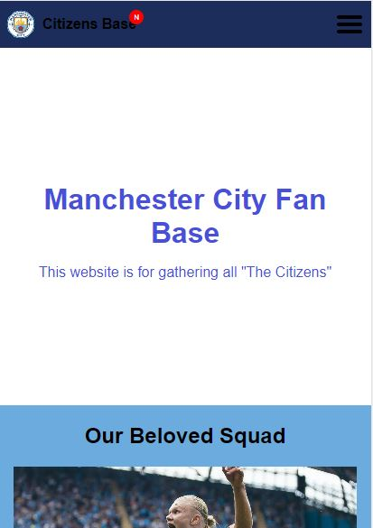
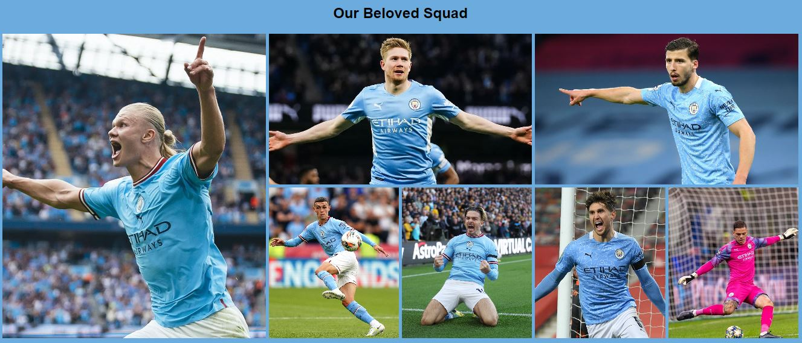
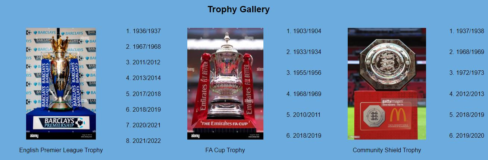

# My Landing Website - Man City Fanbase

This is my project of Landing-Website Assignment
For Week-3 RevoU FSSE Madrid

## Links/URLs:

- <https://w3-landing-website-anggihp.netlify.app/>
- <https://teamcolorcodes.com/manchester-city-fc-colors/>
- <https://www.transfermarkt.com/manchester-city/erfolge/verein/281>
- Inspiration: <https://astonishing-llama-40b674.netlify.app/>

## Colors

- Sky Blue: #6CABDD
- Blue: #1C2C5B
- White: #ffffff

## Screenshots

### Desktop

### Mobile

### Symmetrical Grid

### Asymmetrical Grid

