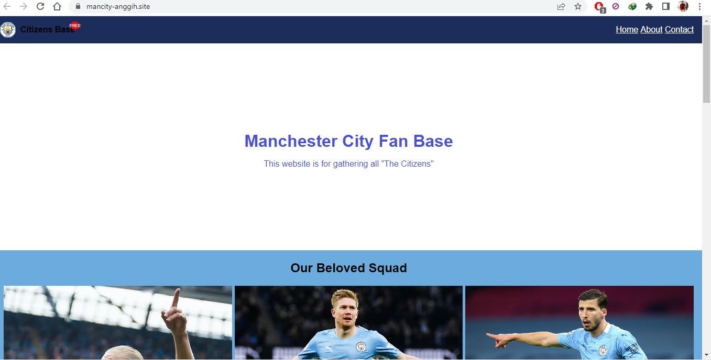

# Week 4 Assignment - Deployment - Anggih

This is my work on Deployment Website as assignment of Week 4
FSSE Madrid 2023

## Links/URLs:

- <https://w3-landing-website-anggihp.netlify.app/>
- <https://teamcolorcodes.com/manchester-city-fc-colors/>
- <https://www.transfermarkt.com/manchester-city/erfolge/verein/281>
- Inspiration: <https://astonishing-llama-40b674.netlify.app/>

## My Website Project Preview

Home Page

## Deployment Step - Netlify

1. Go to <https://www.netlify.com/>

2. Sign Up account

3. After completing sign up data, you will face the home page of netlify

4. To make deployment process, scroll down in the home page and choose "Add new site"

5. Click and you will have this option as below, then choose "Import an existing project"

6. Choose Git Provider

7. Choose GitHub Repository

8. Setting the site before deploying, can leave the setting as default

9. Deployment Finish

